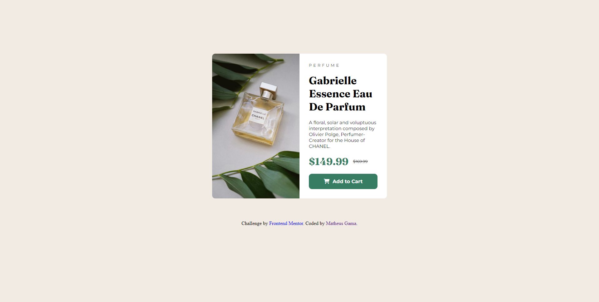

# Frontend Mentor - Product preview card component

## Infos

- :package: novas funcionalidades
- :up: atualizações 
- :ant: correção de bug
- :checkered_flag: release

## Learning

- HTML: Posicionamento de itens
- HTML: Classificação de div
- HTML: Organização de Layout
- CSS : Responsividade
- CSS : Orientação de itens
- CSS : Estilização 

### Screenshot

## Author

- Website - [Matheus Gama](https://mth-gama.github.io/)
- Frontend Mentor - [@mth-gama](https://www.frontendmentor.io/profile/mth-gama)
- GitHub - [@mth-gama](https://github.com/mth-gama)

## Acknowledgments

Projeto solo
